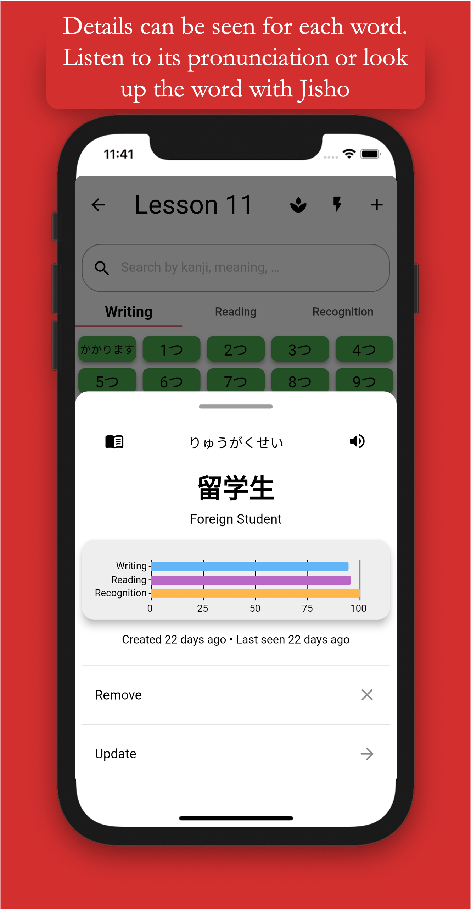
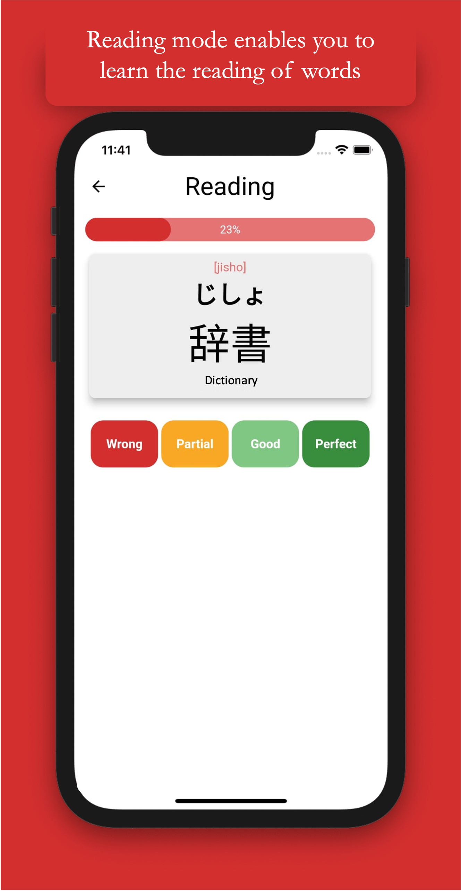
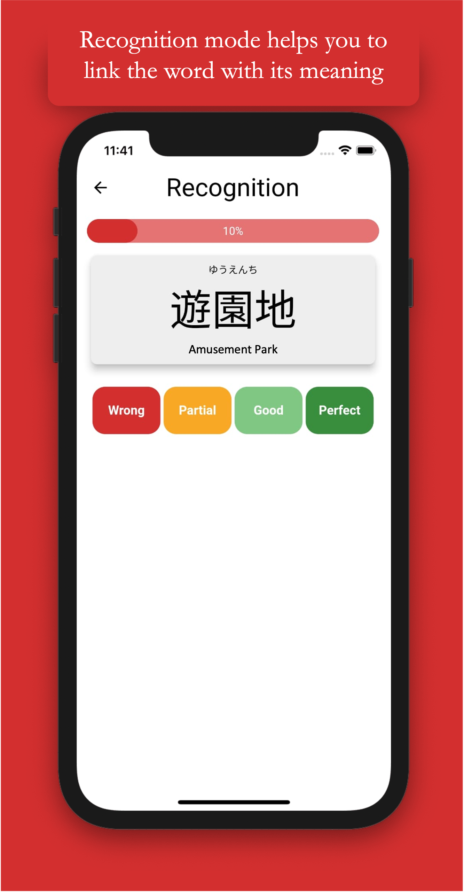

# KanPractice

A simple app for studying the japanese vocabulary you will learn in your japanese learning journey based on cards with meaning, pronunciation and kanji.

Build your own word or sentences lists and study them whenever you want.

    

## Screenshots

  
  
  

  
  
  

## Making your own KanPractice

If you want to replicate this app on your device with a custom back-end, fork the repo and include your own Google Services files for iOS or Android. Make sure your back-end matches the models described in code, although you can also change them to match yours!

If you wish to distribute a new app based on this one, remember to change the Bundle ID on iOS and Package on Android and make sure to acknowledge this work on your newly created app!
- *For iOS*: make sure you create your own Provisioning Profile and Certificate for Apple devices and export them to XCode. 
- *For Android*: create the `jks` file for signing using `keytool`, and create the `key.properties` file under `android/` as in the [official documentation](https://flutter.dev/docs/deployment/android#create-an-upload-keystore).

## Code Structure for Contributing

Code is based on 2 main folders: `ui` and `core`, with self explanatory meanings. On `main.dart` you will find the main `Widget` that runs the app with all of its configuration.

### Language Addition

The language management system is handled by JSON files located under `lib/core/localization/`. Current languages are Spanish and English.
Contribution needed for more languages to be added.

If you wish to contribute by adding a new language, you must perform these actions:

- Copy and paste an already added language JSON file and create the new language file with the name: `<language_code>.json`.
- Then, add the language into the supported locales in `lib/main.dart` under the `EasyLocalization` widget.
- You are good. In case you want to build the app for iOS, you must include the localization in the `info.plist` under the key `CFBundleLocalizations`.

### `Core`

Subdivided in:

- `database`: related code for database management (creation of db, queries, db models and helper constants).
- `firebase`: related code for firebase and backup management (services of back up and authentication, queries and firebase models).
- `preferences`: related code for the Shared Preferences helper to store key-value data in the device.
- `routing`: related code for managing the routing of the pages of the app.
- `utils`: code that is purely functional and that is used across the app.

Please, refer to the comments to better understand the code.

### `UI`

Subdivided in:

- `pages`: the different pages are subdivided in their respective folder, each one having their own bloc management (when needed).
- `theme`: purely UI code as colors, theming, heights...
- `widgets`: UI components with functional elements that are reused across the app.

