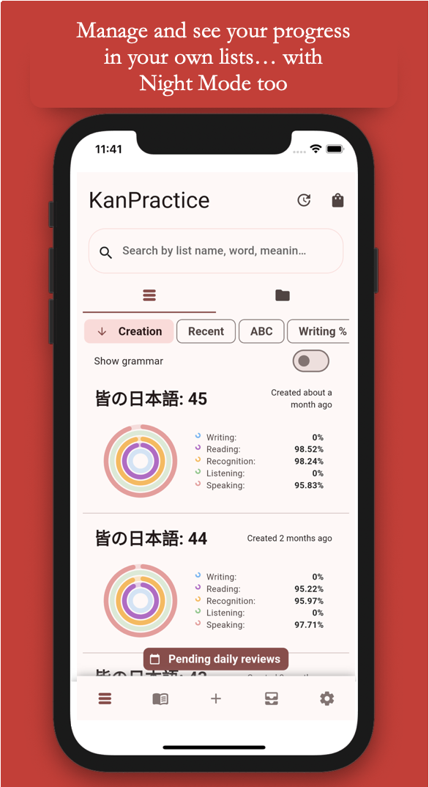
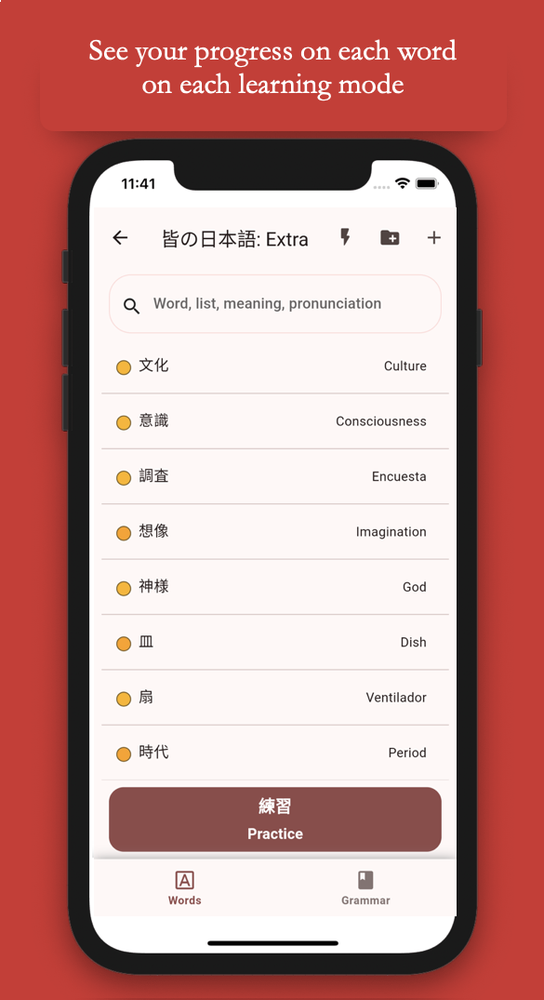
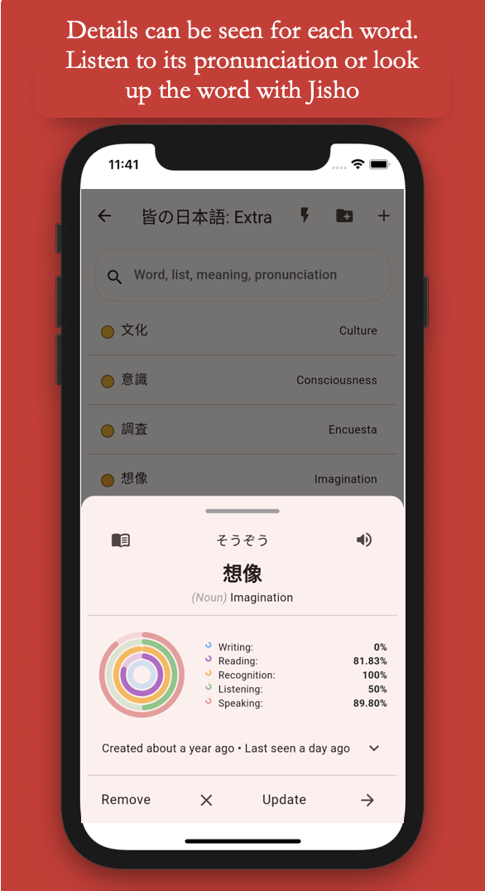
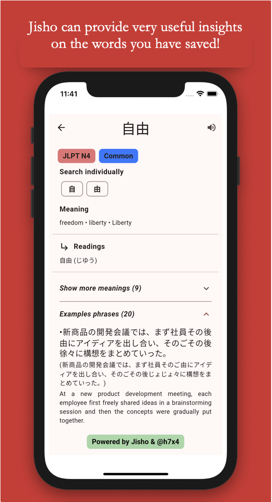

# KanPractice

A simple app for studying the japanese vocabulary you will learn in your japanese learning journey based on cards with meaning, pronunciation and kanji.

Build your own word or sentences lists and study them whenever you want.

    

## Screenshots

  
  
  
  

  
  
  

## Making your own KanPractice

If you want to replicate this app on your device with a custom back-end, fork the repo and include your own Google Services files for iOS or Android. Make sure your back-end matches the models described in code, although you can also change them to match yours!

If you wish to distribute a new app based on this one, remember to change the Bundle ID on iOS and Package on Android and make sure to acknowledge this work on your newly created app!
- *For iOS*: make sure you create your own Provisioning Profile and Certificate for Apple devices and export them to XCode. 
- *For Android*: create the `jks` file for signing using `keytool`, and create the `key.properties` file under `android/` as in the [official documentation](https://flutter.dev/docs/deployment/android#create-an-upload-keystore).

## Code Structure and Architecture

Code is based on 2 main folders: `ui` and `core`, with self explanatory meanings. On `main.dart` you will find the main `Widget` that runs the app with all of its configuration.

Architecture is based on the __BLoC pattern__ ([reference](https://pub.dev/packages/flutter_bloc)), which separates business logic from the UI. Any heavy loading from the local DB or Firebase will be performed and listened from a dedicated BLoC. Custom events and states are created for each BLoC to properly update the necessary UI elements accordingly.

Along with BLoC, the __lazy loading pattern__ is used ([reference](https://en.wikipedia.org/wiki/Lazy_loading)). Lazy loading serves as a light weight mode to serve large lists to UI. The method is to load small batches from a large list and loading even more batches when the user reaches the end or a certain point of the list.

### 1. Code: `Core`

Subdivided in:

- `database`: related code for database management (creation of db, queries, db models and helper constants).
- `firebase`: related code for firebase and backup management (services of back up and authentication, queries and firebase models).
- `jisho`: related code for the connection to the Jisho API.
- `localization`: available translations.
- `preferences`: related code for the Shared Preferences helper to store key-value data in the device.
- `routing`: related code for managing the routing of the pages of the app.
- `tflite`: related code for the instantiation and inference of the Tensorflow Lite model for recognizing kanji, used on the dictionary.
- `utils`: code that is purely functional and that is used across the app.

Please, refer to the comments to better understand the code and feel free to navigate through the code with the help of your IDE to understand better the architecture.

### 2. Code: `UI`

Subdivided in:

- `pages`: the different pages are subdivided in their respective folder, each one having their own bloc management (when needed).
- `theme`: purely UI code as colors, theming, heights...
- `widgets`: UI components with functional elements that are reused across the app.

### 3. Code: BLoC

In some `ui/pages` folder, subdivided in:

- `blocx_event`: where events are defined. These events are launched from the UI layer to the Business Logic (BL) layer to handle the logic there.
- `blocx_state`: where states are defined. These states are emitted from the BL to the UI. When a certain event has finished, a state is emitted to update the UI layer.
- `blocx_bloc`: where all the business logic is defined. Events' content is defined here and it is this class the one that the UI will instantiate to initialize the BLoC pattern.

### 4. Code: Lazy Loading

In order to use lazy loading we have to make changes in the UI, BL and DB layer:

- <u>UI Layer</u>: an `ScrollController` is appended to the desired `ListView`. When reaching the end of the list, a new `loading` event will be transmitted to the `bloc`. In this event, an `offset` will be updated by 1 everytime the user reaches the end of the list to inform the BL that is needed to get the next batch.
- <u>BL Layer</u>: in order to keep track of the whole list, a private list `fullList` is created on the `bloc` class. When the UI launches `loading`, a new list is created (`fullListCopy`) as a copy of `fullList`. Is this `fullListCopy` in which the batches will be added when gathered from DB and the list that will be forwarded to the UI layer for repaint purposes. The `fullList`, when the state is emitted, must be updated with the new batch in order to keep track of the whole list, as `fullListCopy` is only a temporary list.
- <u>DB Layer</u>: in the database layer, in case of using SQLite, a `LIMIT` and `OFFSET` must be appended to the query. The `LIMIT` is maintained constant, but the `OFFSET` is a changing value with the formula `limit X offset`. In this way, the DB always retrieves batches of size `limit` and shifting `limit X offset` times everytime the user reaches the list's end.

In case this plain explanation is confusing, you can refer to the `test_history` example ([reference](https://github.com/gabrielglbh/Kan-Practice/tree/main/lib/ui/pages/test_history)).

### Language Addition

The language management system is handled by JSON files located under `lib/core/localization/`. Current languages are Spanish and English.
Contribution needed for more languages to be added.

If you wish to contribute by adding a new language, you must perform these actions:

- Copy and paste an already added language JSON file and create the new language file with the name: `<language_code>.json`.
- Then, add the language into the supported locales in `lib/main.dart` under the `EasyLocalization` widget.
- You are good. In case you want to build the app for iOS, you must include the localization in the `info.plist` under the key `CFBundleLocalizations`.
