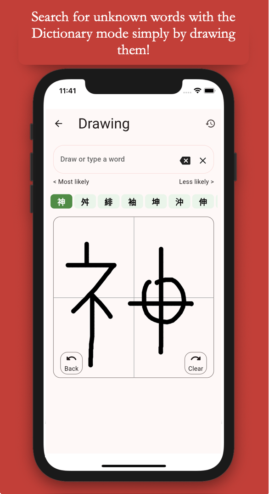
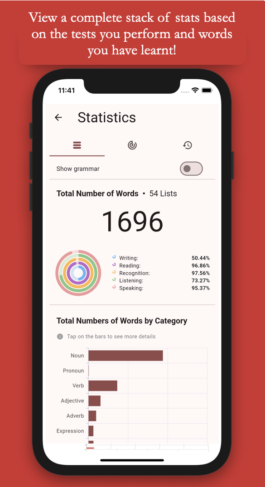

# KanPractice

A simple app for studying the japanese vocabulary and grammar you will learn in your japanese learning journey based on cards with meaning, pronunciation, kanji and more!

Build your own word, sentences and grammar lists and study them whenever you want.

## Available for Android and WEB 

WEB is the new platform for KanPractice, new in 2025. Data sharing between Android and web accounts is only available through backups. Notice, site has minor cuts:

- No market translations
- No OCR nor ML Kit for character recognition

Everything else is full on board!

    

    

## Screenshots

  
  
  
  

  
  
  

## Making your own KanPractice

If you want to replicate this app on your device with a custom back-end, fork the repo and include your own Google Services files for iOS or Android. Make sure your back-end matches the models described in code, although you can also change them to match yours!

If you wish to distribute a new app based on this one, remember to change the Bundle ID on iOS and Package on Android and make sure to acknowledge this work on your newly created app!

- _For iOS_: make sure you create your own Provisioning Profile and Certificate for Apple devices and export them to XCode.
- _For Android_: create the `jks` file for signing using `keytool`, and create the `key.properties` file under `android/` as in the [official documentation](https://flutter.dev/docs/deployment/android#create-an-upload-keystore).

Aside from this, you will have to provide your own OpenAI API Token.

## Code Structure and Architecture

Code is based on the DDD Clean Architecture paradigm, [learn more](https://medium.com/@ushimaru/beginners-guide-to-flutter-with-ddd-87d4c476c3cb). This design pattern uses abstraction (domains) to create code that has very low coupling and that makes it very easy to test, maintain and change data providers at any given moment.

This architecture is reached with **BLoC pattern** and **Dependencies Injection**.

- **BLoC pattern** ([reference](https://pub.dev/packages/flutter_bloc)) separates business logic from the UI. Any heavy loading will be performed and listened from a dedicated BLoC. Custom events and states are created for each BLoC to properly update the necessary UI elements accordingly. Along with BLoC, we use **lazy loading** or **pagination** ([reference](https://en.wikipedia.org/wiki/Lazy_loading)). Lazy loading serves as a light weight mode to serve large lists to UI. The method is to load small batches from a large list and loading even more batches when the user reaches the end or a certain point of the list.

- For **Dependency Injection** I used **GetIt** ([reference](https://pub.dev/packages/get_it)) and **Injection** ([reference](https://pub.dev/packages/injectable)).
  - **GetIt** is a simple Service Locator that allows us to use our services, in this case BLoC classes, without the need of using the context of the app. This makes it easier to access the BLoC class from anywhere in the app, even outside the UI.
  - **Injection** is simply a code generator built for GetIt. This makes far more easier the configuration of the service locator using custom annotations to tell the code generator to register either factories, singletons or lazy singletons.

With this in mind, we divide the code into 4 main folders: `application`, `domain`, `infrastructure` and `presentation`. These folders come from the below figure, representing the 4 different layers that will interact with the `domain`.

  

### 1. `application`

Layer in which all the services are presented. All BLoC classes and custom services will be retained in this layer. None of the actual functionality is performed in this layer. This only serves as an interface for the `presentation` layer to call the actual functionality in the `infrastructure` layer via the abstract repositories created in `domain` layer.

This means that all of the BLoC classes and services will have as constructor parameters the repositories created in the `domain` to achieve the extra level of abstraction.

All BLoC classes, dependant on the usage in the app, will have a `@lazySingleton` annotation to indicate `getIt` that the classes are persistent. Thus with the Custom Services, we will annotate them with `@injectable`.

### 2. `domain`

The main layer. This will contain the models that the UI conveys and the public abstract repositories that define the data extraction. These are like a contracts for the `infrastructure` layer to comply with, as they will implement them.

The repositories are used in the `application` and `infrastructure` layer to maintain the abstraction from the actual data providers.

### 3. `infrastrucure`

This is the only layer that communicates with the data providers, and thus, the only layer we will have to modify in case we want to change providers. This leads to maintaining the `domain` contracts all across the app.

The repository implementations are gathered in here. Again, as constructor parameters they will take the `domain` interfaces, but with the nuance that the implementation actually uses the Data Providers APIs, injected with `getIt` in the constructor.

All repository implementations will be annotated with `@LazySingleton(as: I_x_Repository)` to tell `getIt` to create a lazy singleton instance from the `domain` repository and use it as the `infrastructure` implementation.

### 4. `presentation`

All the UI elements such as widgets, pages, routing... are located in this layer. In order to retrieve data to paint the UI with, this layer comunicates only with the `application` layer's BLoC classes and custom needed Services such as `PreferencesService` or `TextToSpeechService`.

You will find all pages as subfolders of the root with one special `core` folder inside it too. This folder contains the reusable widgets, localization, routing, utils, custom types and theming of the whole app.

### 5. Extra: Lazy Loading

In order to use lazy loading we have to make changes in the UI, BL and DB layer:

- <u>`presentation` layer</u>: an `ScrollController` is appended to the desired `ListView`. When reaching the end of the list, a new `loading` event will be transmitted to the `bloc`. In this event, an `offset` will be updated by 1 everytime the user reaches the end of the list to inform the BL that is needed to get the next batch.
- <u>`application` layer</u>: in order to keep track of the whole list, a private list `fullList` is created on the `bloc` class. When the UI launches `loading`, a new list is created (`fullListCopy`) as a copy of `fullList`. Is this `fullListCopy` in which the batches will be added when gathered from DB and the list that will be forwarded to the UI layer for repaint purposes. The `fullList`, when the state is emitted, must be updated with the new batch in order to keep track of the whole list, as `fullListCopy` is only a temporary list.
- <u>`infrastructure` layer</u>: if using SQLite, a `LIMIT` and `OFFSET` must be appended to the query. The `LIMIT` is maintained constant, but the `OFFSET` is a changing value with the formula `limit X offset`. In this way, the DB always retrieves batches of size `limit` and shifting `limit X offset` times everytime the user reaches the list's end.

In case this plain explanation is confusing, you can refer to the `word_history` example ([reference](https://github.com/gabrielglbh/Kan-Practice/tree/main/lib/application/word_history/word_history_bloc.dart)).

### Language Addition

The language management system is handled by JSON files located under `lib/presentation/core/localization/`. Current languages are Spanish, English and German.
Contribution needed for more languages to be added.

If you wish to contribute by adding a new language, you must perform these actions:

- Copy and paste an already added language JSON file and create the new language file with the name: `<language_code>.json`.
- Then, add the language into the supported locales in `lib/main.dart` under the `EasyLocalization` widget.
- You are good. In case you want to build the app for iOS, you must include the localization in the `info.plist` under the key `CFBundleLocalizations`.
